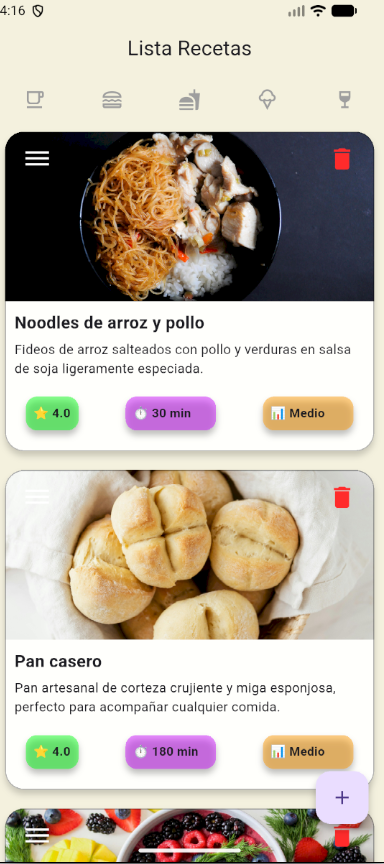
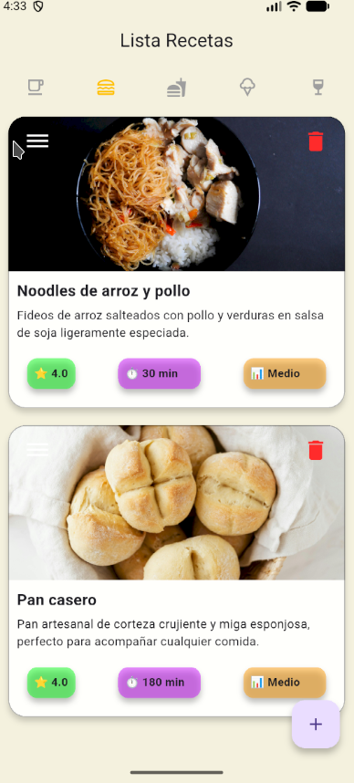
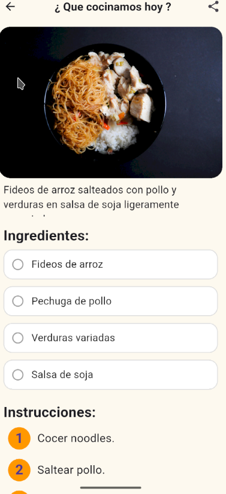
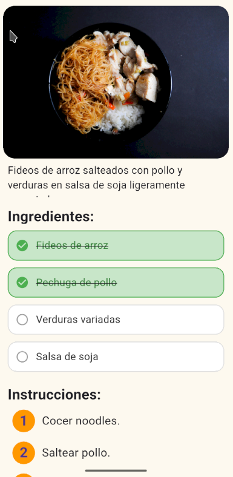
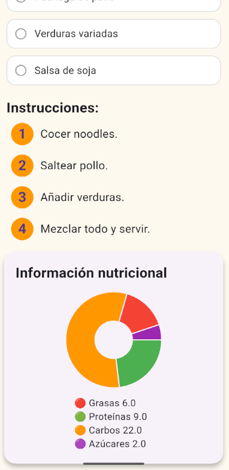
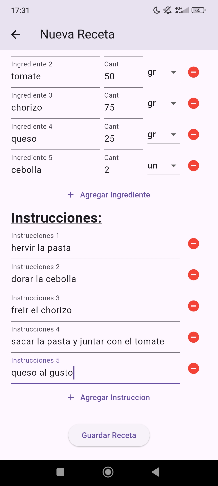
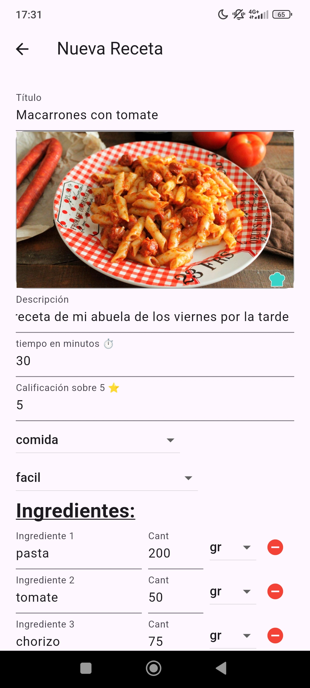
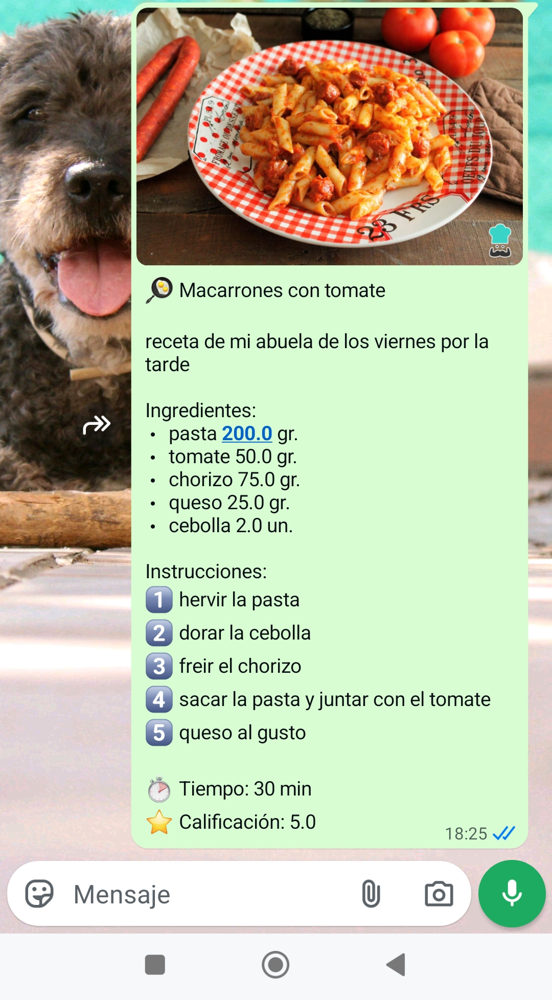

# Recetario App

Una app de recetas desarrollada en Flutter, con almacenamiento local usando
SQFlite. Permite ver recetas, añadir nuevas, borrar, compartirlas y consultar
valores nutricionales de los ingredientes.

## Características
- Lista de recetas con imagen,tiempo, dificultad y valoración.
- Añadir, editar y eliminar recetas (CRUD).
- Consulta nutricional de los ingredientes de cada receta.
- Ordenadas por ID o título.
- Datos persistentes usando SQLite.

## Tecnologías
- Flutter
- Dart
- SQFlite
- Path

## Instalación
1. Clona el repositorio
   - </> Bash
   - git clone https://github.com/dana7677/recetario_app.git
   - cd recetario_app
   
3. Instala las dependencias
   - </> Bash
   - flutter pub get
   
5. Ejecuta la app en tu emulador o dispositivo.
    - </> Bash
    - flutter run

## Estructura del proyecto
- /lib-> Código principal de Flutter.
  - /database -> Base de datos SQFlite y helpers.
  - /appFolder-> Scripts principales
- /assets-> Imágenes y recursos

## Mejora Futura
- Añadir buscador por ingrediente, favoritos o filtrar por valor nutricional.
- Añadir sincronización con backend o almacenamiento en la nube.
- UI más avanzada con más animaciones y búsqueda en tiempo real.

## Licencia 
Proyecto libre para uso educativo y portfolio personal.

## Mas información

https://drive.google.com/file/d/10vRHadAag6-YHnRSbqQTmo-FEjeRtFCc/view?usp=sharing

## Screenshots

### Listado de recetas

   
   

### Detalles

   
   
   

## Screenshots 2

### Nueva Receta

  
  

### Compartir receta

  

## Gifs

- Ventana Principal Lista de Recetas.

  

- Ventana secundaria Detalles de la receta seleccionada.
  

- Ventana secundaria Nueva Receta con información insertada po el usuario.
  

- Ventana de detalles mostrando nuestra receta y sus detalles.
  

